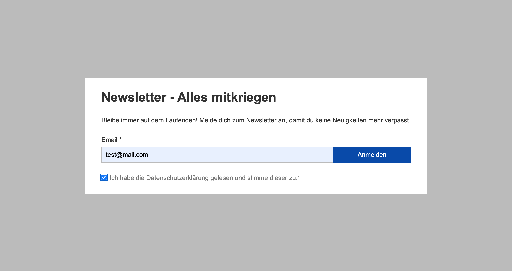
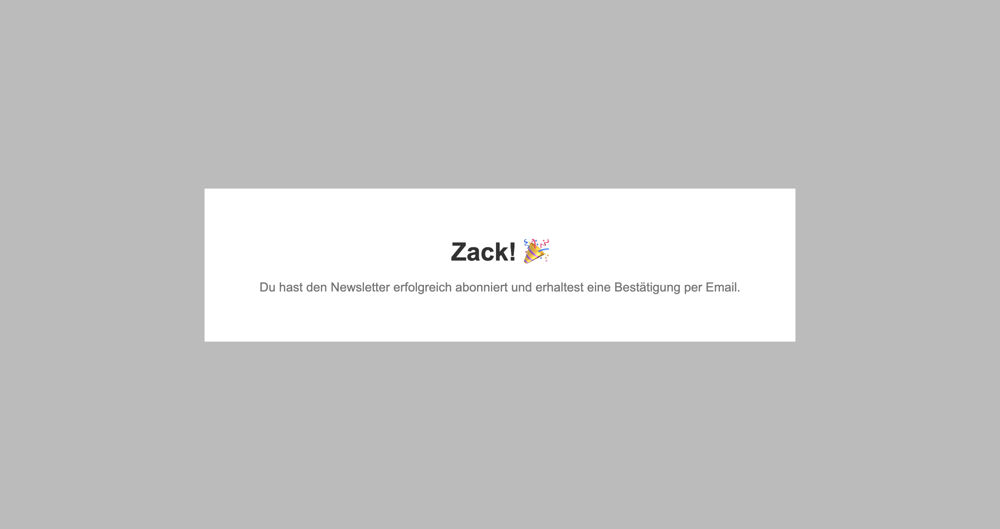

# Newsletter Anmeldung

## Beschreibung

Diese Web-App bietet eine einfache Benutzeroberfläche mit zwei Eingabefeldern: E-Mail-Adresse und Datenschutzerklärung-Checkbox. Die eingegebenen Daten werden per POST-Request an den Server übermittelt. Die Web-App überprüft die E-Mail-Adresse sowohl syntaktisch als auch mittels DNS-Check. Fehlermeldungen werden im UI ausgegeben. Validierte E-Mail-Adressen werden in einer CSV und JSON-Datei gespeichert. Zum Schluss wird eine Anmeldebestätigung an die angegebene E-Mail-Adresse geschickt.

Im Rahmen meiner Ausbildung zum geprüften Software-Entwickler am WIFI Wien habe ich im Modul **"NodeJS Basis"** diese Web-App als Übung entwickelt.

## Funktionen

- E-Mail-Adressüberprüfung
- Datenübermittlung per POST-Request
- Speicherung in CSV und JSON Format
- Anmeldebestätigung per E-Mail

## Technologien

- **Client:** HTML, CSS, JavaScript
- **Server:** Node.js

## Ausgabe

